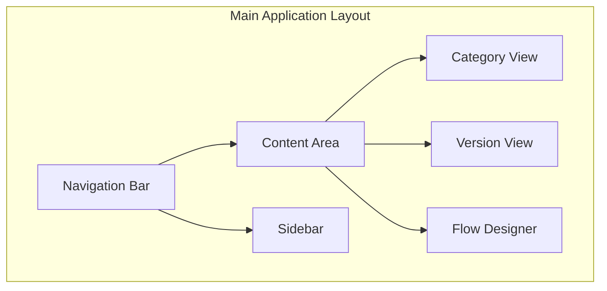
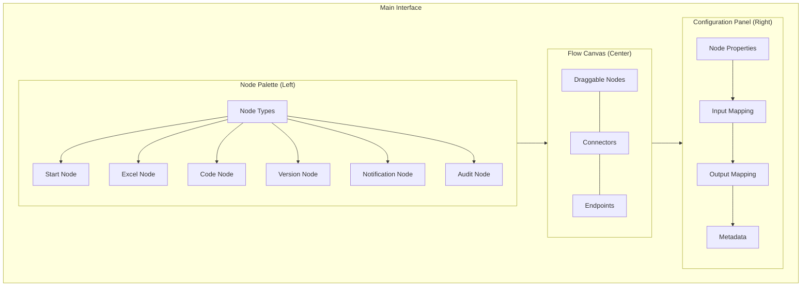
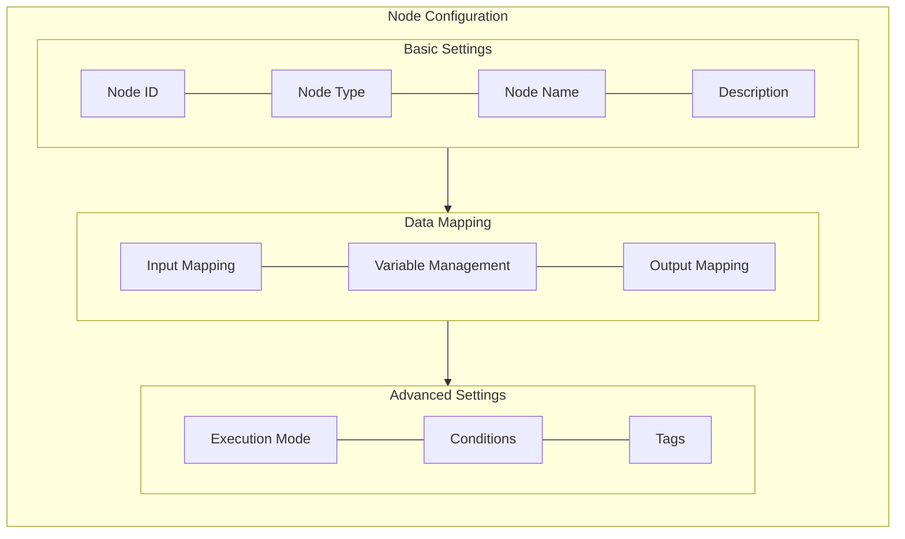
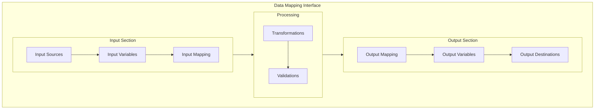

# Rules Manager UI Plan

## Overview
The Rules Manager UI provides a comprehensive interface for managing rule categories, versions, and different rule types (Excel, Code, Flow). The application follows a modular architecture with distinct sections for category management, version control, and rule type-specific interfaces, particularly focusing on an intuitive flow designer with drag-and-drop capabilities.

## Application Structure

## Core Components

### 1. Navigation Bar
- **Location**: Top of the application
- **Features**:
  - Application logo and name
  - Main navigation menu
  - User profile and settings
  - Quick actions (Create New, Search)

### 2. Sidebar
- **Location**: Left side (collapsible)
- **Features**:
  - Category tree view
  - Version filters
  - Quick access to recent items

### 3. Category Management
- **Layout**: List view with cards
- **Features**:
  - Category creation/editing
  - Category metadata display
  - Version count and status
  - Quick actions (Edit, Delete, View Versions)

### 4. Version Management
- **Layout**: Tabbed interface with version list
- **Features**:
  - Version history timeline
  - Version comparison
  - Version activation controls
  - Type-specific editors (Excel, Code, Flow)

## Layout Structure

## Components Description

### 1. Node Palette
- **Location**: Left sidebar
- **Purpose**: Houses all available node types
- **Features**:
  - Categorized node types
  - Drag handles for node creation
  - Visual icons representing node types
  - Search/filter functionality

### 2. Flow Canvas
- **Location**: Center area
- **Purpose**: Main workspace for flow design
- **Features**:
  - Grid-based layout
  - Drag-and-drop node placement
  - Automatic connector routing
  - Multi-select and group operations
  - Zoom and pan controls
  - Mini-map for large flows

### 3. Configuration Panel
- **Location**: Right sidebar
- **Purpose**: Node configuration and properties
- **Features**:
  - Dynamic forms based on node type
  - JSON editor for advanced configuration
  - Variable mapping interface
  - Metadata management

## Node Configuration Interface

## Data Mapping Interface

## Interaction Flows

### Node Creation Flow
1. User drags a node type from palette
2. Ghost node follows cursor
3. On drop:
   - Node is created with default configuration
   - Configuration panel opens
   - Connection points are initialized

### Connection Creation Flow
1. User clicks on source endpoint
2. Temporary connector follows cursor
3. Valid target endpoints highlight
4. On connection:
   - Data mapping panel opens
   - Connection validation runs
   - Flow updates

### Configuration Flow
1. User selects node
2. Configuration panel updates
3. Changes are validated in real-time
4. Auto-save or manual save option

## Visual Elements

### Node Representation
- Distinct colors for different node types
- Status indicators (configured/unconfigured)
- Error/warning indicators
- Connection points with clear input/output distinction

### Connection Visualization
- Different line styles for different connection types
- Conditional routing indicators
- Data flow direction markers
- Status indicators (valid/invalid)

## Version-Specific Interfaces

### 1. Excel Version Editor
- File upload/selection
- Rule mapping interface
- Column mapping tools
- Preview capabilities

### 2. Code Version Editor
- Monaco-based code editor
- Syntax highlighting
- Auto-completion
- Input/output configuration
- Code validation

### 3. Flow Version Editor
- Visual flow designer
- Node configuration
- Connection management
- Variable system
- Testing tools

## State Management

### 1. Application State
- User preferences
- Navigation state
- Selected category/version
- UI theme settings

### 2. Flow Designer State
- Canvas state
- Selected nodes
- Connection state
- Undo/redo history
- Clipboard data

## Responsive Design

### 1. Desktop (>1200px)
- Full three-panel layout
- Expanded toolbars
- Detailed property panels

### 2. Tablet (768px - 1200px)
- Collapsible sidebars
- Compact toolbars
- Modal property panels

### 3. Mobile (<768px)
- Single panel view
- Bottom navigation
- Fullscreen editors

## Accessibility

### 1. Keyboard Navigation
- Shortcut keys for common actions
- Focus management
- Screen reader support

### 2. Visual Accessibility
- High contrast mode
- Adjustable font sizes
- Color blind friendly palette

## Implementation Technologies

### 1. Frontend Framework
- React with TypeScript
- Material-UI components
- Styled-components

### 2. Flow Designer
- React Flow for node canvas
- D3.js for custom visualizations
- Monaco Editor for code nodes

### 3. State Management
- Redux for global state
- React Context for local state
- Immer for immutable updates

## Development Guidelines

### 1. Component Structure
- Atomic design principles
- Reusable components
- Consistent naming

### 2. State Management
- Centralized store
- Action creators
- Typed selectors

### 3. Testing Strategy
- Unit tests for components
- Integration tests for flows
- E2E tests for critical paths